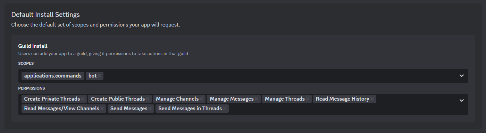

# Discord.js TypeScript Template

A simple TypeScript + Discord.js template so you can start making your Discord bot with ease. It does all the preliminary setup for you, so you basically only need to create the bot and hit start to get it running! This template is intended for those who just want to make a basic bot or need the flexibility to customize it to their needs.

*(Looking for something more advanced, batteries-included? Check out [Discord-Bot-TypeScript-Template](https://github.com/KevinNovak/Discord-Bot-TypeScript-Template).)*

If you haven't already, read the [Discord.js Guide](https://discordjs.guide/). It does a good job of demonstrating what you can do with Discord.js.

## Getting Started

### 1. Create a new Discord bot with at least the following scopes and permissions. You can do this in the installation tab of the [Discord Developer Portal](https://discord.com/developers/applications). Afterwards, you can install the bot in your server.



### 2. Clone the repository or use it as a template.

```sh
git clone https://github.com/dlustre/discordjs-typescript-template.git
```

### 3. Create a `.env` file in the root of the project and add your bot token and client ID. Your bot token and client ID can be found in the [Discord Developer Portal](https://discord.com/developers/applications) and navigating to the "Bot" tab and the "OAuth2" tab.

    ```env
    TOKEN=<your bot token>
    CLIENT_ID=<your client ID>
    ```

### 4. Install dependencies

#### npm

```sh
npm install
```

#### pnpm

```sh
pnpm install
```

#### yarn

```sh
yarn install
```

### 5. Run the bot and try /ping in your server!

#### npm

```sh
npm start
```

#### pnpm

```sh
pnpm start
```

#### yarn

```sh
yarn start
```

## Commands

The bot comes with a few commands to get you started. You can add your own commands within the `commands` directory.

## Contributing

If you have any suggestions or improvements, feel free to contribute!
